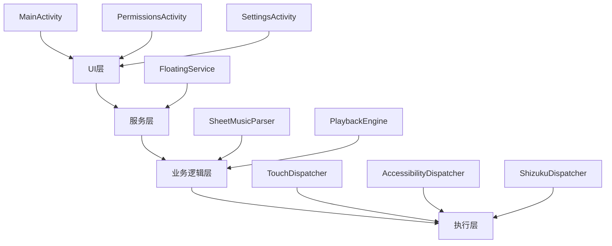
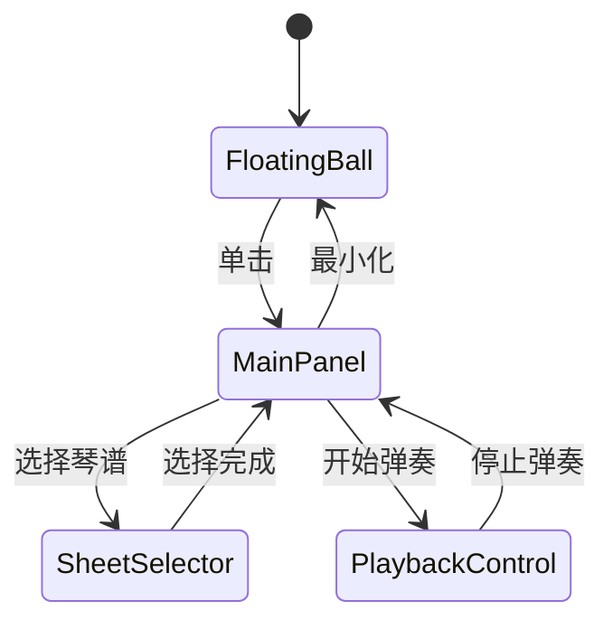

# 光奏 (GuangZou) 应用开发需求规格书 v2.0

> **项目简介**：为《Sky光·遇》设计的Android自动弹奏应用，支持多种触控模拟方式，提供直观的用户界面和精准的弹奏体验。

---

## 📋 项目概览

### 核心目标
- 🎛️ **双触控模式**：无障碍服务 + Shizuku 双重选择
- 🎨 **友好界面**：现代化UI设计，操作简单直观
- ⚙️ **高度可配置**：支持主题、透明度、图标等个性化设置

### 技术栈
```
开发语言: Kotlin
构建工具: Gradle (Kotlin DSL)
框架: Android Jetpack
最低版本: API 28 (Android 9.0)
```

---

## 🏗️ 系统架构

### 分层设计


### 核心模块职责
| 模块 | 职责 | 关键类 |
|------|------|--------|
| **UI层** | 用户交互界面 | MainActivity, PermissionsActivity, SettingsActivity |
| **服务层** | 悬浮窗管理 | FloatingService (前台服务) |
| **业务逻辑层** | 琴谱解析与弹奏控制 | SheetMusicParser, PlaybackEngine |
| **执行层** | 触摸事件分发 | TouchDispatcher + 具体实现 |

---

## 🖥️ 界面设计详规

### 主界面 (MainActivity)

#### 布局结构
```
┌─────────────────────────────────┐
│            光奏                  │ ← 应用标题
├─────────────────────────────────┤
│ 📱 信息面板                  │
│   当前分辨率: 1080x2340           │
│   选择分辨率: 1080x2340          │
├─────────────────────────────────┤
│ [🎈 开启悬浮窗]                  │ ← 主要操作
├─────────────────────────────────┤
│ 📜 琴谱库 (可展开)               │
│   ▼ 小幸运 | 田馥甄 | 120 BPM   │
│     稻香 | 周杰伦 | 108 BPM     │
├─────────────────────────────────┤
│ [⚙️] 设置    [🔐] 权限管理      │ ← 导航按钮
└─────────────────────────────────┘
```

#### 核心功能
- **智能分辨率检测**：自动识别设备分辨率并匹配最佳预设
- **琴谱扫描**：监听 `/storage/emulated/0/光奏/谱/` 目录变化
- **权限预检**：启动悬浮窗前自动检查所需权限

#### 优化改进
- **新增**：最近使用列表 - 快速访问常用琴谱
- **改进**：状态栏显示服务运行状态

### 权限管理页面 (PermissionsActivity)

#### 权限卡片设计
```kotlin
data class PermissionCard(
    val name: String,
    val description: String,
    val isRequired: Boolean,
    val status: PermissionStatus,
    val action: PermissionAction
)
```

#### 权限清单
| 权限类型 | 必需性 | 说明 | 检测方式 |
|----------|--------|------|----------|
| 无障碍服务 | **必需** | 用于模拟触摸操作 | `AccessibilityManager.isEnabled()` |
| 悬浮窗显示 | **必需** | 显示控制面板 | `Settings.canDrawOverlays()` |
| 存储访问 | **必需** | 读取琴谱文件 | 动态权限检查 |
| Shizuku服务 | 可选 | 高精度触摸模拟 | Shizuku状态查询 |

#### 优化改进
- **新增**：权限申请进度追踪
- **新增**：一键授权流程引导
- **改进**：权限状态实时更新

### 设置页面 (SettingsActivity)

#### 设置分类
```
🎨 外观设置
   ├─ 应用主题 (跟随系统/亮色/暗色)
   ├─ 主悬浮窗透明度 (0-100%)
   └─ 悬浮球透明度 (0-100%)

🎯 弹奏设置
   ├─ 分辨率方案 (自动检测推荐)
   ├─ 触摸模式 (无障碍/Shizuku)
   └─ 弹奏延迟补偿 (0-200ms)

🎪 个性化
   ├─ 悬浮球图标 (系统选择器)
   ├─ 按键音效开关
   └─ 振动反馈开关
```

#### 优化改进
- **新增**：弹奏延迟补偿设置
- **新增**：按键音效和振动反馈
- **新增**：预设方案导入/导出功能

---

## 🎈 悬浮窗系统重设计

### 状态机模型


### 悬浮窗组件

#### 1. 悬浮球 (FloatingBall)
- **交互**：拖拽移动 + 单击展开
- **外观**：可自定义图标，支持动态透明度
- **吸附**：智能边缘吸附功能

#### 2. 主控制面板 (MainPanel)
```
┌─────────────────────┐
│ 🎵 [选择琴谱]       │
│ ⚙️ [设置]           │
│ 📱 [键位预览]       │
│ ➖ [最小化]         │
└─────────────────────┘
```

#### 3. 琴谱选择器 (SheetSelector)
- **布局**：垂直滚动列表，支持搜索过滤
- **信息**：标题、作者、BPM、总时长

#### 4. 弹奏控制器 (PlaybackControl)
```
┌─────────────────────┐
│ 🎵 小幸运 - 田馥甄   │
│ ♪ 120 BPM | 3:24   │
├─────────────────────┤
│ [▶️] [⏸️] [⏹️]      │
│ ●━━━━━━━━━━━━ 1:23   │ ← 进度条
├─────────────────────┤
│ [🔄] [📱] [➖]      │
│ 循环  预览  最小化   │
└─────────────────────┘
```

### 键位预览系统
- **可视化**：在屏幕对应坐标绘制不可触摸的半透明圆形标记
- **实时反馈**：在选择完琴谱时打开预览功能则显示当前弹奏的触摸位置

---

## ⚙️ 核心引擎优化

### 弹奏引擎 (PlaybackEngine)

#### 架构改进
```kotlin
class PlaybackEngine {
    private val scheduler = PrecisionScheduler()
    private val coordinator = TouchCoordinator()
    private val compensator = DelayCompensator()
    
    suspend fun play(sheet: SheetMusic) {
        val timeline = scheduler.createTimeline(sheet)
        timeline.forEach { event ->
            val compensatedTime = compensator.adjust(event.time)
            delay(compensatedTime)
            coordinator.dispatch(event.touches)
        }
    }
}
```

#### 核心优化
- **高精度计时**：使用协程 + 纳秒级时间戳
- **预加载机制**：提前计算触摸事件序列
- **延迟补偿**：支持系统延迟自动校正
- **多指支持**：同时触发多个按键

### 触摸分发器重构

#### 统一接口
```kotlin
interface TouchDispatcher {
    suspend fun tap(x: Float, y: Float)
    suspend fun swipe(startX: Float, startY: Float, endX: Float, endY: Float, duration: Long)
    fun isAvailable(): Boolean
    fun getLatency(): Long  // 获取延迟信息
}
```

---

## 📊 数据管理

### 琴谱格式规范
```json
{
  "title": "小星星",
  "author": "",
  "bpm": 320,

  "notes": [
    { "key": [0], "delay": 0 },
    { "key": [0], "delay": 500 },
    ...
 ]
}
```

### 配置存储优化
- **SharedPreferences** → **DataStore**：更好的异步支持
- **配置版本管理**：支持配置迁移和备份

---

## 🚀 开发建议

### 开发优先级
1. **Phase 1**：基础架构 + 主界面 + 权限管理
2. **Phase 2**：悬浮窗系统 + 基础弹奏功能
3. **Phase 3**：高级功能 + UI优化 + 性能调优

### 技术要点
- **内存管理**：及时释放悬浮窗资源
- **电池优化**：合理使用前台服务和Wake Lock
- **异常处理**：完善的错误恢复机制
- **日志系统**：便于调试的分级日志

### 测试策略
- **单元测试**：核心算法和数据处理
- **UI测试**：关键用户流程自动化测试
- **性能测试**：内存泄漏和电量消耗监控
- **兼容性测试**：多设备多分辨率适配验证

---

## 📝 版本变更记录

### v2.0 优化内容
- ✅ 重构架构设计，采用分层模型
- ✅ 优化悬浮窗状态管理，引入状态机
- ✅ 增强弹奏引擎，支持延迟补偿
- ✅ 改进权限管理流程
- ✅ 新增键位校准功能
- ✅ 完善琴谱格式规范
- ✅ 增加开发指导和测试策略